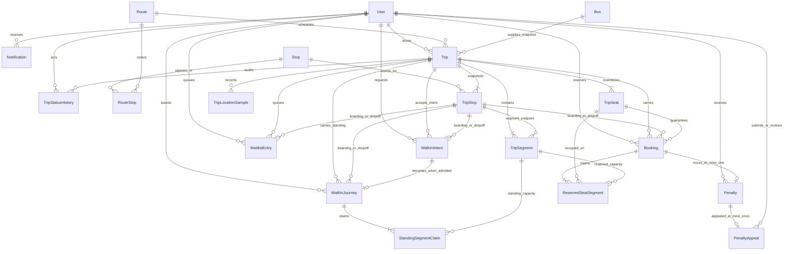

# Final Architecture v2 ERD

**Status:** Release-candidate reference diagram  
**Source:** `prisma/schema.prisma` plus committed PostgreSQL constraints

## Reading the shared boundary

- Wong report emphasis: Stop, Route, RouteStop, Bus, Trip, TripStop,
  TripSegment, TripSeat, TripStatusHistory, and TripLocationSample.
- Lee report emphasis: Booking, ReservedSeatSegment, WaitlistEntry,
  WalkInIntent, WalkInJourney, StandingSegmentClaim, Penalty, PenaltyAppeal,
  Notification, and the passenger aspect of User.
- Trip, TripStop, TripSegment, TripSeat, User, and Bus capacity snapshots are
  shared integration concepts. The emphasis is documentation scope, never a
  claim of sole coding ownership.

The removed `Seat`, `SeatStatus`, `DeviceStatusLog`, and `DeviceSignal` models
are intentionally absent. Several same-Trip composite foreign keys and partial
indexes are implemented in migration SQL even where Mermaid cannot express
them.
