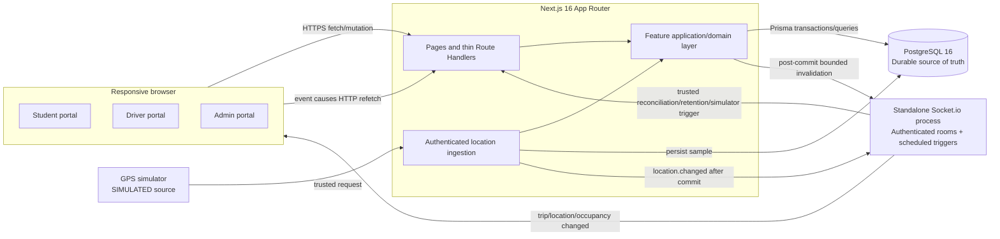
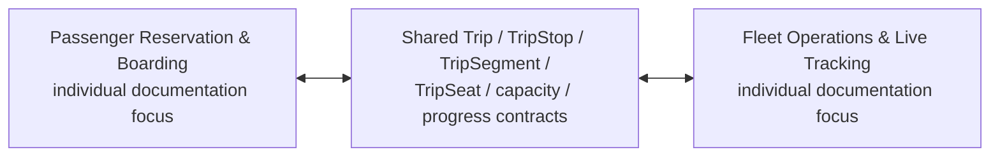

# Final Runtime Architecture

The browser never accesses PostgreSQL directly. Socket.io transports minimal,
non-authoritative invalidations; missing events are recovered by HTTP refetch.
The simulator uses the same source-neutral ingestion use case intended for a
future physical GPS adapter.

This second diagram is an academic explanation of integration inside one
application. It does not create separate runtimes, databases, repositories, or
exclusive implementation-ownership claims.
